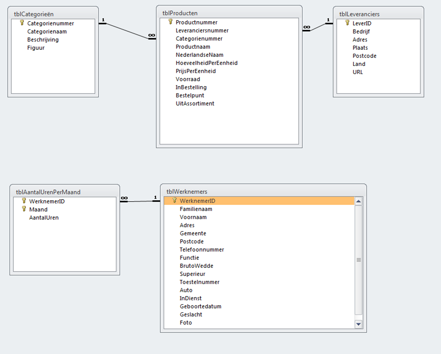
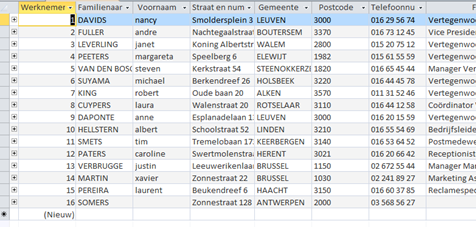

# Terminologie

- tabel
- veld
- record
- schema
- query
- stored procedures
- ...

Een **relationele databank** is een verzameling (2-dimensionale) tabellen met
relaties tussen.

Relaties hebben een **multipliciteit** of **cardinaliteit**:

- 1-op-1
- 1-op-veel
- veel-op-veel
 

 
Een kolom in een tabel noemen we een **veld**. Elk veld heeft een type.
Een rij in een tabel noemen we een **record**.

Enkele eigenschappen van relationele databanken:
- Twee rijen mogen nooit helemaal hetzelfde zijn, de records moeten **uniek** zijn
(vandaar primary keys)
- De **volgorde** van de rijen mag geen belang hebben.

> men zegt ook wel dat er geen **intrinsieke betekenis** aan de volgorde mag
gehecht worden

- In elke cel mag maar één waarde staan.

> men zegt ook wel dat elke cel **atomaire** gegevens moet bevatten. (b.v. in een
veld Taal van een persoon mogen geen 3 talen staan) 

# Sleutels (keys)

Een rij (record) wordt uniek benaderd via haar sleutel.

De **primaire sleutel** van een tabel is een veld dat per record (rij) een
unieke waarde heeft. Er mogen dus nooit 2 dezelfde primaire sleutels bestaan in
een tabel.

Een **refererende sleutel** is een verwijzing naar een primaire sleutel uit een
andere tabel. Op deze manier worden tabellen aan elkaar gekoppeld.

In het bovenstaand voorbeeld is b.v. het veld `Categorienummer`:

- een primaire sleutel in de tabel `tblCategorieën`
- een refererende sleutel in de tabel `tblProducten`

(Merk op dat primaire en refererende sleutel niet noodzakelijk dezelfde naam
moeten hebben, ze moeten enkel naar dezelfde gegevens verwijzen. Kijk
bijvoorbeeld naar de primaire sleutel `LeverID` in `tblLeveranciers` en de
bijhorende refererende sleutel `Leveranciersnummer` in `tblProducten`.)
 

# SQL 

- Structured Query Language
- een (ondertussen al vrij oude) zogenaamde **4e generatie**-taal

> in 4e generatie-talen **omschrijft** de code een oplossing voor een probleem 
 i.t.t. tot bij procedurele- of OOP-talen waar de code stap-voor-stap
**instructies** geeft.

Microsoft (en andere *vendors*) hebben hun eigen uitbreiding op standaard SQL.
Microsoft's variant heet `Transact-SQL` of `T-SQL`.

Het resultaat van een query is:

- vaak een tabel
- soms slechts een enkele waarde

SQL is ook in staat om data:

- toe te voegen (`INSERT`)
- te wijzigen (`UPDATE`) 
- tabellen aan te maken (`CREATE TABLE`)
 

# Database software

Meestal is een database een apart draaiend server-proces.
Vaak krijgen ze zelfs hun eigen dedicated hardware server of cluster
van database servers.

> In de context van dit vak (**software**) bedoelen we met een
database-server een draaiend server-proces en niet de hardware!

Er zijn vele database-servers:

- Microsoft SQL Server
- MySQL
- PostgreSQL
- ...

Meestal draait op een systeem telkens maar 1 instantie (desnoods van meerdere
fabrikanten). Vaak benader je een (productie-)database via een IP-adres.
Er zijn dus bijgevolg meerdere databases (schema's) aanwezig in 1 database-server.

> Access is database-software maar bevat ook een editor om GUI front-ends
te maken : applicaties die bovenop de databases draaien. Bovendien zitten er
ook editors in om de tabellen en relaties mee te bewerken.

> Een database-server is eigenlijk niet meer dan een oplossing om op de best
mogelijke manier grote hoeveelheden data bij te houden. Database software
is geoptimaliseerd om b.v. **snel** data te kunnen zoeken of **compact** data 
op te slaan.
Een moeilijk probleem doet zich ook voor wanneer **meerdere mensen tegelijkertijd
data wegschrijven** naar de databank.
Dankzij complexe database software, moet een programmeur zich niet telkens met
al die moeilijke problemen bezighouden.
